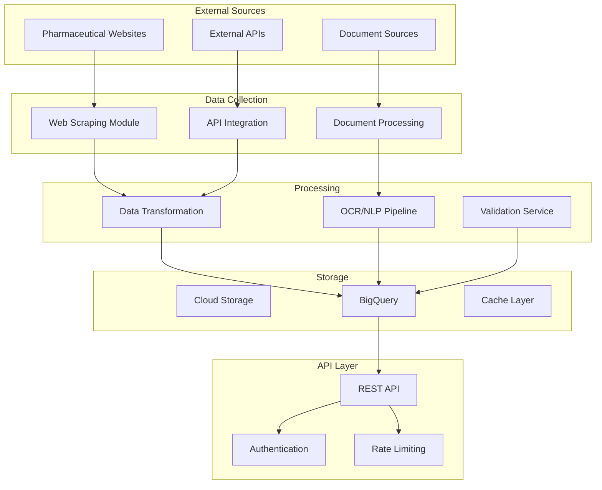

# Pharmaceutical Data Pipeline Platform

[](https://github.com/pharma-pipeline/builds)
[](https://github.com/pharma-pipeline/coverage)
[](https://github.com/pharma-pipeline/docs)

A cloud-native system for automated pharmaceutical data collection and processing, built on Google Cloud Platform (GCP).

## Overview

The Pharmaceutical Data Pipeline Platform is an enterprise-grade infrastructure solution that automates the collection, processing, and analysis of pharmaceutical industry data from multiple sources. Built with scalability and maintainability in mind, the system provides:

- Modular web scraping framework for custom data collection
- Advanced document processing pipeline with OCR and NLP capabilities
- Scalable data transformation services
- Secure REST API access
- Automated scaling and monitoring
- Comprehensive audit logging and security controls

### System Architecture



## Prerequisites

### Required Accounts and Access
- Google Cloud Platform (GCP) account with billing enabled
- GitHub account with repository access
- Necessary IAM roles and permissions

### Development Tools
- Python 3.9+
- Docker 20.10+
- Google Cloud SDK 400.0.0+
- Terraform 1.3+
- Git 2.30+

### Environment Setup
- GCP project with required APIs enabled
- Service account with appropriate permissions
- Local development environment
- CI/CD pipeline access

## Getting Started

### Installation

1. Clone the repository:
```bash
git clone https://github.com/pharma-pipeline/platform.git
cd platform
```

2. Configure GCP credentials:
```bash
gcloud auth application-default login
export GOOGLE_CLOUD_PROJECT="your-project-id"
```

3. Set up environment variables:
```bash
cp .env.example .env
# Edit .env with your configuration
```

4. Install dependencies:
```bash
python -m venv venv
source venv/bin/activate  # or `venv\Scripts\activate` on Windows
pip install -r requirements.txt
```

### Development Setup

1. Local Environment Configuration:
```bash
# Install development dependencies
pip install -r requirements-dev.txt

# Set up pre-commit hooks
pre-commit install
```

2. Docker Environment:
```bash
# Build development containers
docker-compose build

# Start development environment
docker-compose up -d
```

3. Infrastructure Setup:
```bash
# Initialize Terraform
cd infrastructure
terraform init

# Plan deployment
terraform plan -out=tfplan

# Apply infrastructure
terraform apply tfplan
```

## Project Structure

```
pharmaceutical-pipeline/
├── .github/
│   ├── workflows/          # CI/CD pipeline definitions
│   └── CODEOWNERS         # Code ownership assignments
├── docs/                  # Detailed documentation
├── infrastructure/        # Terraform configurations
├── src/
│   ├── scraping/         # Web scraping module
│   ├── processing/       # Document processing
│   ├── api/             # REST API implementation
│   └── common/          # Shared utilities
├── tests/               # Test suites
├── .env.example        # Environment variable template
├── docker-compose.yml  # Docker configuration
└── README.md          # This file
```

## Development Workflow

1. Create a new feature branch:
```bash
git checkout -b feature/your-feature-name
```

2. Implement changes following our coding standards

3. Run tests:
```bash
pytest tests/
```

4. Submit a pull request for review

## Deployment

### Staging Environment
```bash
# Deploy to staging
gcloud run deploy pharma-pipeline-staging \
    --source . \
    --region us-central1 \
    --project your-project-id
```

### Production Environment
```bash
# Deploy to production
gcloud run deploy pharma-pipeline-prod \
    --source . \
    --region us-central1 \
    --project your-project-id
```

## Documentation

- [API Documentation](./docs/api.md)
- [Infrastructure Setup](./docs/infrastructure.md)
- [Development Guide](./docs/development.md)
- [Security Guidelines](./docs/security.md)

## Security

- All code changes require review and approval
- Secrets are managed through GCP Secret Manager
- Authentication required for all API endpoints
- Regular security audits and penetration testing
- Compliance with pharmaceutical industry standards

## Contributing

1. Review our [Contributing Guidelines](./CONTRIBUTING.md)
2. Check the [Code of Conduct](./CODE_OF_CONDUCT.md)
3. Submit pull requests for review

## Support

- Create issues for bug reports and feature requests
- Contact technical support: support@pharma-pipeline.com
- Emergency support: +1 (xxx) xxx-xxxx

## License

Copyright © 2023 Pharmaceutical Data Pipeline Platform

Licensed under the Apache License, Version 2.0 - see [LICENSE](./LICENSE) for details.

## Maintainers

- Lead Architects: @pharma-pipeline/lead-architects
- Core Team: @pharma-pipeline/core-team

## Version History

See [CHANGELOG.md](./CHANGELOG.md) for release history and migration guides.