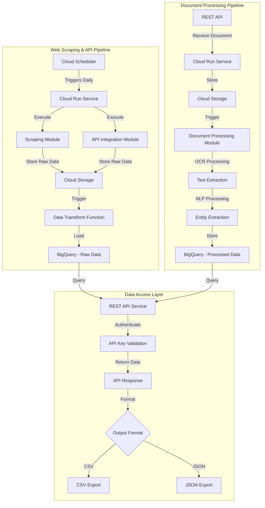
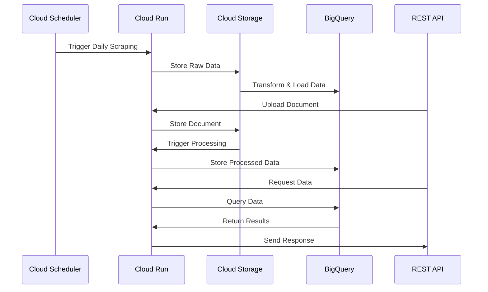
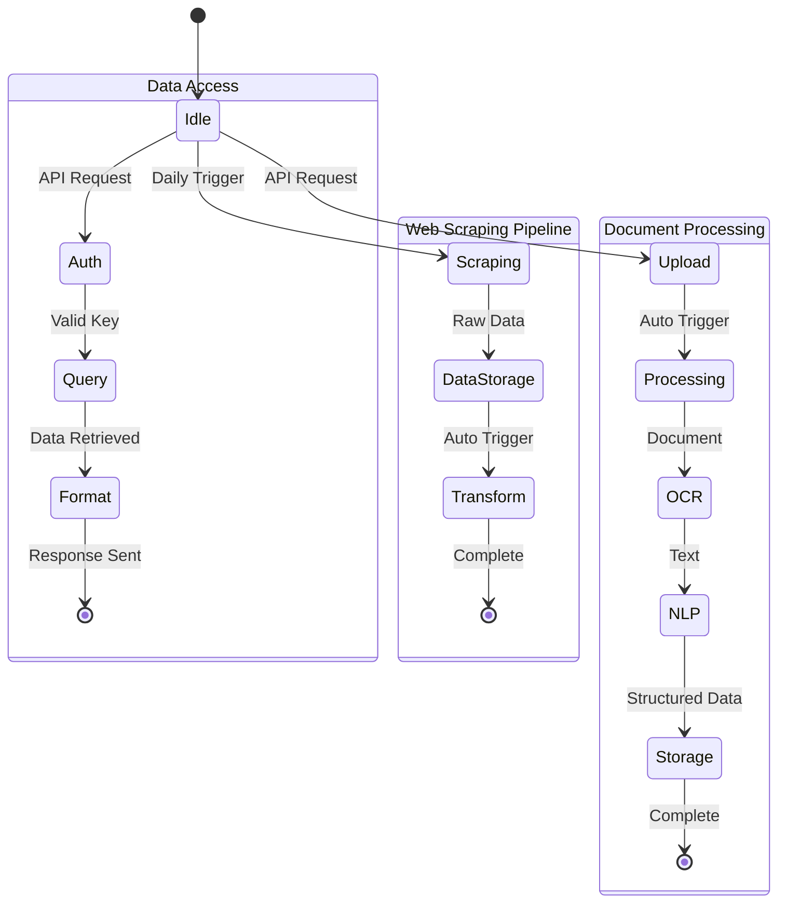
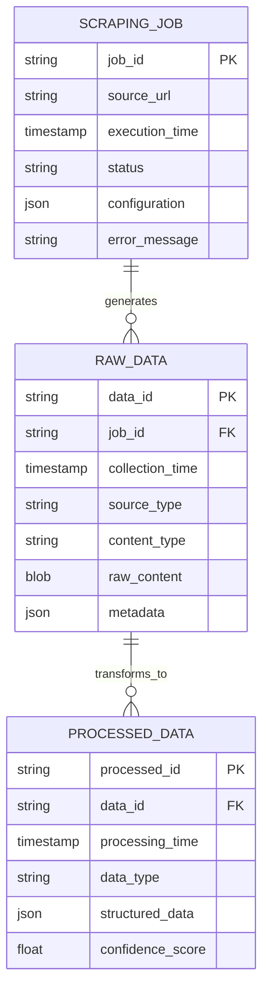
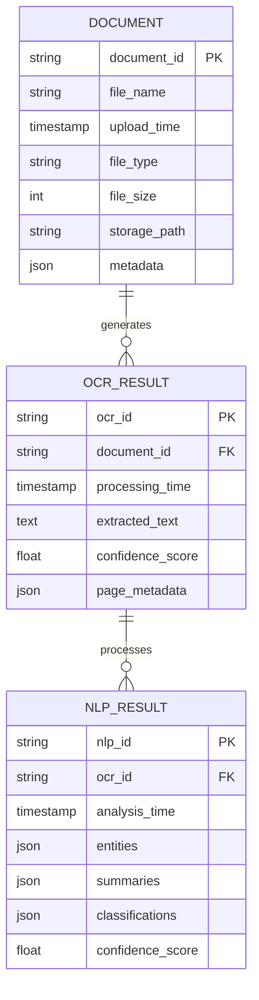
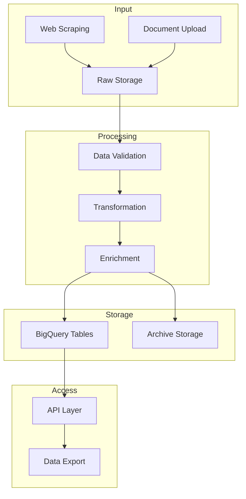
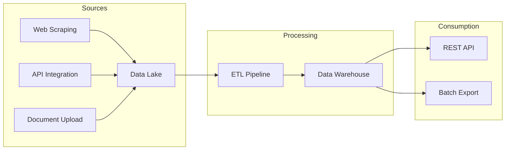
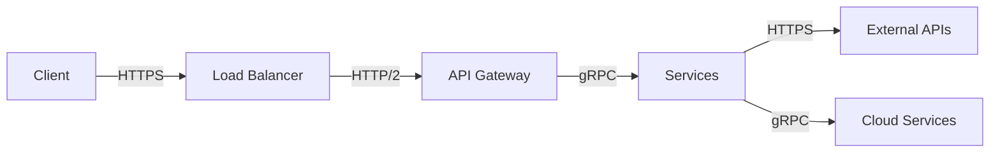

# Product Requirements Document (PRD)

# 1. INTRODUCTION

## 1.1 Purpose

This Product Requirements Document (PRD) outlines the comprehensive technical specifications and requirements for developing a modular data pipeline platform. The document serves as a reference for:

- Development teams implementing the core infrastructure and backend systems
- System architects designing the modular components
- DevOps engineers handling cloud deployment and automation
- Project stakeholders overseeing platform development
- Future developers who will implement custom scraping and processing logic

## 1.2 Scope

The platform encompasses a scalable, cloud-based system built on Google Cloud Platform (GCP) that automates and manages two primary data processing workflows:

### Core Functionalities:

- Automated web scraping framework for pharmaceutical company websites
- API integration system for external data sources
- Document processing pipeline for regulatory documents
- Data storage and transformation infrastructure
- RESTful API for data access and retrieval

### Key Features:

- Modular architecture allowing custom implementation of scraping logic
- Independent document processing pipeline with configurable OCR and NLP
- Automated daily execution of data collection tasks
- Structured data storage in BigQuery
- Secure API access with authentication
- Comprehensive logging and monitoring system

### Out of Scope:

- Specific web scraping implementation details
- Custom OCR and NLP processing logic
- Frontend user interface
- Business intelligence and reporting tools
- Data visualization components

# 2. PRODUCT DESCRIPTION

## 2.1 Product Perspective

The modular data pipeline platform operates as a standalone system within the Google Cloud Platform ecosystem, interacting with various GCP services:

- Cloud Storage for raw data storage
- BigQuery for structured data warehousing
- Cloud Run for containerized services
- Cloud Scheduler for automation
- Cloud Logging for monitoring

The platform consists of two primary independent modules that can operate in isolation:

1. Web Scraping & API Integration Pipeline
2. Document Processing Pipeline

Both modules feed into a unified data storage layer and are accessible through a common REST API.

## 2.2 Product Functions

### Web Scraping & API Integration

- Template-based scraping framework with configurable targets
- Automated daily data collection from pharmaceutical websites
- Structured API integration system for external data sources
- Raw data storage with metadata tracking
- Automated retry mechanisms and failure handling

### Document Processing

- Document ingestion via API endpoints
- OCR processing pipeline with customizable logic
- NLP analysis framework for text processing
- Structured data transformation and storage
- Batch processing capabilities

### Data Access & Management

- RESTful API for data retrieval and querying
- Dataset export functionality (CSV/JSON)
- Metadata management and tracking
- Authentication and access control
- Automated data archival and retention

## 2.3 User Characteristics

### Technical Developers

- Expertise: Advanced
- Primary tasks: Implementing custom scraping logic, developing processing algorithms
- Technical requirements: Python programming, web scraping experience, NLP knowledge

### Data Engineers

- Expertise: Intermediate to Advanced
- Primary tasks: Pipeline monitoring, data quality management
- Technical requirements: SQL, GCP experience, ETL knowledge

### API Consumers

- Expertise: Intermediate
- Primary tasks: Data retrieval and integration
- Technical requirements: REST API understanding, basic programming skills

## 2.4 Constraints

### Technical Constraints

- GCP service limitations and quotas
- API rate limits from external data sources
- Storage capacity restrictions
- Processing time limitations for OCR/NLP tasks
- Network bandwidth constraints for large document processing

### Regulatory Constraints

- Data privacy compliance requirements
- Pharmaceutical industry regulations
- Data retention policies
- Access control requirements

### Operational Constraints

- Daily scheduling windows for automated tasks
- Budget limitations for cloud resources
- Processing capacity during peak loads
- Maintenance windows

## 2.5 Assumptions and Dependencies

### Assumptions

- Stable internet connectivity for web scraping
- Consistent document format standards
- Sufficient computing resources availability
- Pharmaceutical websites maintain stable HTML structure
- External APIs maintain backward compatibility

### Dependencies

- Google Cloud Platform services availability
- External API service uptime
- OCR processing libraries
- NLP processing frameworks
- Third-party authentication services
- Document format standards
- Web scraping libraries and tools

# 3. PROCESS FLOWCHART

# 4. FUNCTIONAL REQUIREMENTS

## 4.1 Web Scraping & API Integration Module

### Feature WS-01: Scraping Framework

**ID**: WS-01  
**Description**: Template-based framework for implementing custom web scraping logic  
**Priority**: High

| Requirement ID | Description | Priority |
| --- | --- | --- |
| WS-01-01 | Provide abstract base classes for scraper implementation | High |
| WS-01-02 | Support configuration files for target URLs and selectors | High |
| WS-01-03 | Include retry mechanism with configurable attempts | Medium |
| WS-01-04 | Implement rate limiting and request throttling | High |
| WS-01-05 | Generate detailed logs for each scraping session | Medium |

### Feature WS-02: API Integration System

**ID**: WS-02  
**Description**: Framework for external API integrations  
**Priority**: High

| Requirement ID | Description | Priority |
| --- | --- | --- |
| WS-02-01 | Support REST and GraphQL API integrations | High |
| WS-02-02 | Handle API authentication and key management | High |
| WS-02-03 | Implement request/response logging | Medium |
| WS-02-04 | Support pagination and bulk data retrieval | Medium |
| WS-02-05 | Include error handling and response validation | High |

## 4.2 Document Processing Module

### Feature DP-01: Document Ingestion

**ID**: DP-01  
**Description**: System for document upload and initial processing  
**Priority**: High

| Requirement ID | Description | Priority |
| --- | --- | --- |
| DP-01-01 | Accept PDF, image, and text file uploads via API | High |
| DP-01-02 | Validate file formats and sizes | High |
| DP-01-03 | Generate unique document identifiers | Medium |
| DP-01-04 | Store raw documents in Cloud Storage | High |
| DP-01-05 | Track document metadata and processing status | Medium |

### Feature DP-02: OCR Processing

**ID**: DP-02  
**Description**: Framework for implementing custom OCR logic  
**Priority**: High

| Requirement ID | Description | Priority |
| --- | --- | --- |
| DP-02-01 | Provide OCR processing interface | High |
| DP-02-02 | Support batch processing capabilities | Medium |
| DP-02-03 | Include image preprocessing options | Medium |
| DP-02-04 | Generate confidence scores for OCR results | Low |
| DP-02-05 | Store extracted text in structured format | High |

## 4.3 Data Storage & Access

### Feature DS-01: Data Transformation

**ID**: DS-01  
**Description**: Pipeline for transforming raw data into structured formats  
**Priority**: High

| Requirement ID | Description | Priority |
| --- | --- | --- |
| DS-01-01 | Define BigQuery schema for structured data | High |
| DS-01-02 | Implement data validation rules | High |
| DS-01-03 | Support incremental data loading | Medium |
| DS-01-04 | Handle data type conversions | Medium |
| DS-01-05 | Maintain data lineage information | Low |

### Feature DS-02: REST API

**ID**: DS-02  
**Description**: API for data access and retrieval  
**Priority**: High

| Requirement ID | Description | Priority |
| --- | --- | --- |
| DS-02-01 | Implement API key authentication | High |
| DS-02-02 | Support filtering and pagination | High |
| DS-02-03 | Enable CSV/JSON export formats | Medium |
| DS-02-04 | Include rate limiting per API key | Medium |
| DS-02-05 | Provide detailed API documentation | High |

## 4.4 Automation & Monitoring

### Feature AM-01: Task Scheduling

**ID**: AM-01  
**Description**: Automated execution of data collection tasks  
**Priority**: High

| Requirement ID | Description | Priority |
| --- | --- | --- |
| AM-01-01 | Schedule daily scraping jobs via Cloud Scheduler | High |
| AM-01-02 | Configure retry policies for failed jobs | High |
| AM-01-03 | Implement job dependencies and ordering | Medium |
| AM-01-04 | Support manual job triggering | Low |
| AM-01-05 | Monitor job execution times | Medium |

### Feature AM-02: System Monitoring

**ID**: AM-02  
**Description**: Comprehensive logging and monitoring system  
**Priority**: High

| Requirement ID | Description | Priority |
| --- | --- | --- |
| AM-02-01 | Log all system operations to Cloud Logging | High |
| AM-02-02 | Track system resource usage | Medium |
| AM-02-03 | Monitor API endpoint performance | Medium |
| AM-02-04 | Generate daily processing reports | Low |
| AM-02-05 | Alert on critical system failures | High |

# 5. NON-FUNCTIONAL REQUIREMENTS

## 5.1 Performance Requirements

### Response Time

| Metric | Requirement |
| --- | --- |
| API Response Time | 95% of requests \< 500ms |
| Document Upload Processing | \< 30 seconds for files up to 10MB |
| OCR Processing Time | \< 2 minutes per document |
| Batch Processing Throughput | Minimum 100 documents/hour |
| Query Response Time | \< 2 seconds for complex BigQuery operations |

### Resource Usage

| Resource | Limit |
| --- | --- |
| CPU Utilization | \< 80% during peak loads |
| Memory Usage | \< 2GB per Cloud Run instance |
| Storage Growth | \< 100GB/month |
| Network Bandwidth | \< 50Mbps per instance |
| BigQuery Slots | \< 2000 concurrent slots |

## 5.2 Safety Requirements

### System Safety

- Automatic failover mechanisms for critical services
- Data backup every 6 hours with 30-day retention
- Circuit breakers for external API calls
- Graceful degradation during partial system failures
- Automated rollback capabilities for failed deployments

### Data Safety

- Immutable audit logs for all data modifications
- Versioning enabled on Cloud Storage buckets
- Point-in-time recovery for BigQuery tables
- Automated data validation before processing
- Duplicate detection and prevention mechanisms

## 5.3 Security Requirements

### Authentication & Authorization

- API key-based authentication for all endpoints
- Role-based access control (RBAC) for internal services
- OAuth 2.0 implementation for service-to-service communication
- Key rotation policy every 90 days
- Maximum 3 failed authentication attempts before temporary lockout

### Data Security

- At-rest encryption using Google-managed keys
- TLS 1.3 for all data in transit
- VPC Service Controls for resource isolation
- Regular security scanning of container images
- Secrets management using Cloud KMS

### Privacy

- PII data encryption and masking
- Data retention policies enforcement
- Access logging and monitoring
- GDPR compliance mechanisms
- Data anonymization for exports

## 5.4 Quality Requirements

### Availability

- 99.9% uptime for API services
- Maximum planned downtime of 4 hours/month
- Automatic scaling based on load
- Multi-region deployment capability
- Recovery Time Objective (RTO) of 1 hour

### Maintainability

- Modular architecture with loose coupling
- Comprehensive API documentation
- Automated deployment pipelines
- Code coverage minimum 80%
- Standardized logging format

### Scalability

- Horizontal scaling up to 100 concurrent users
- Support for 10x data volume increase
- Auto-scaling based on CPU utilization
- Load balancing across instances
- Partition tolerance for distributed operations

### Reliability

- Automated health checks every 5 minutes
- Retry mechanism for failed operations
- Data consistency checks
- Error rate \< 0.1% for critical operations
- Mean Time Between Failures (MTBF) \> 720 hours

## 5.5 Compliance Requirements

### Regulatory Compliance

- GDPR compliance for data processing
- SOC 2 Type II compliance
- Data residency requirements adherence
- Managing web scraping limits in accordance with robots.txt files (will be done manually by programmers).

### Standards Compliance

- REST API design standards
- OAuth 2.0 implementation standards
- ISO 27001 security standards
- Cloud Security Alliance (CSA) guidelines
- OpenAPI Specification 3.0

### Audit Requirements

- Comprehensive audit trails
- Regular security audits
- Compliance reporting capabilities
- Access control reviews
- Data handling documentation

# 6. DATA REQUIREMENTS

## 6.1 Data Models

### 6.1.1 Web Scraping Data Model

### 6.1.2 Document Processing Data Model

## 6.2 Data Storage

### 6.2.1 Storage Hierarchy

| Layer | Storage Service | Purpose | Retention Period |
| --- | --- | --- | --- |
| Raw Data | Cloud Storage | Original scraped content, documents | 90 days |
| Processed Data | Cloud Storage | OCR/NLP results, transformed data | 30 days |
| Structured Data | BigQuery | Queryable datasets, analytics | 365 days |
| Archived Data | Cloud Storage Archive | Long-term storage | 7 years |

### 6.2.2 Backup and Recovery

| Backup Type | Frequency | Retention | Recovery SLA |
| --- | --- | --- | --- |
| Full Backup | Weekly | 90 days | 4 hours |
| Incremental Backup | Daily | 30 days | 2 hours |
| Point-in-time Recovery | 6 hours | 7 days | 1 hour |
| Cross-region Replication | Real-time | N/A | 15 minutes |

### 6.2.3 Storage Specifications

| Data Type | Format | Compression | Encryption |
| --- | --- | --- | --- |
| Raw Scraping Data | JSON | GZIP | AES-256 |
| Documents | PDF/PNG/JPEG | LZ4 | AES-256 |
| Processed Text | UTF-8 | GZIP | AES-256 |
| Structured Data | Avro/Parquet | Snappy | Column-level |

## 6.3 Data Processing

### 6.3.1 Data Flow

### 6.3.2 Data Security Controls

| Layer | Security Control | Implementation |
| --- | --- | --- |
| Ingestion | Input Validation | Schema validation, size limits |
| Processing | Access Control | IAM roles, service accounts |
| Storage | Encryption | Customer-managed keys (CMEK) |
| Transport | TLS | TLS 1.3, certificate pinning |
| Export | Data Masking | PII redaction, field-level encryption |

### 6.3.3 Data Quality Metrics

| Metric | Target | Monitoring |
| --- | --- | --- |
| Completeness | 99.9% | Daily validation |
| Accuracy | 98% | Sampling checks |
| Timeliness | \< 15min delay | Real-time alerts |
| Consistency | 100% | Schema enforcement |
| Uniqueness | 100% | Duplicate detection |

## 6.4 Data Integration

### 6.4.1 Integration Patterns

### 6.4.2 Data Synchronization

| System | Sync Type | Frequency | Conflict Resolution |
| --- | --- | --- | --- |
| Raw Storage | Incremental | Real-time | Last-write-wins |
| BigQuery | Batch | Daily | Version control |
| Archive | Full | Weekly | Immutable |
| Backup | Differential | 6 hours | Source of truth |

# 7. EXTERNAL INTERFACES

## 7.1 Software Interfaces

### 7.1.1 Google Cloud Platform Services

| Service | Interface Type | Purpose | Protocol |
| --- | --- | --- | --- |
| Cloud Storage | REST API | Raw data storage | HTTPS/JSON |
| BigQuery | Client Library | Data warehousing | gRPC |
| Cloud Run | Container Runtime | Service hosting | HTTP/2 |
| Cloud Scheduler | REST API | Job automation | HTTPS/JSON |
| Cloud Logging | Client Library | System logging | gRPC |

### 7.1.2 External APIs

| API Type | Authentication | Data Format | Rate Limits |
| --- | --- | --- | --- |
| REST APIs | OAuth 2.0/API Key | JSON | Configurable per endpoint |
| GraphQL | Bearer Token | GraphQL/JSON | 1000 requests/hour |
| SFTP | SSH Keys | Binary/Text | 100MB/transfer |
| WebSocket | Token-based | JSON | 100 concurrent connections |

### 7.1.3 Database Interfaces

| Database | Interface Type | Connection Method | Purpose |
| --- | --- | --- | --- |
| BigQuery | SQL | Client Library | Primary data storage |
| Redis | In-memory | TCP | Rate limiting, caching |
| Cloud Storage | Object Storage | REST API | Document storage |

## 7.2 Communication Interfaces

### 7.2.1 Network Protocols

| Protocol | Usage | Security | Port |
| --- | --- | --- | --- |
| HTTPS | API communication | TLS 1.3 | 443 |
| gRPC | Internal services | mTLS | 8443 |
| WebSocket | Real-time updates | WSS | 443 |
| SSH | SFTP transfers | SSH-2 | 22 |

### 7.2.2 Data Formats

| Format | Content Type | Encoding | Compression |
| --- | --- | --- | --- |
| JSON | application/json | UTF-8 | GZIP |
| Protobuf | application/protobuf | Binary | None |
| CSV | text/csv | UTF-8 | GZIP |
| PDF | application/pdf | Binary | Native |

### 7.2.3 API Endpoints

## 7.3 Hardware Interfaces

### 7.3.1 Cloud Infrastructure

| Component | Specifications | Scaling Limits |
| --- | --- | --- |
| Cloud Run | 2 vCPU, 4GB RAM | Auto-scale to 100 instances |
| Network | 10Gbps | 1TB/day transfer |
| Storage | SSD backed | 5TB per bucket |
| Memory | 4GB per instance | 32GB maximum |

### 7.3.2 Resource Requirements

| Resource | Minimum | Recommended | Maximum |
| --- | --- | --- | --- |
| CPU | 1 vCPU | 2 vCPU | 4 vCPU |
| Memory | 2GB | 4GB | 8GB |
| Storage | 100GB | 500GB | 5TB |
| Network | 1Gbps | 5Gbps | 10Gbps |

## 7.4 Software Dependencies

### 7.4.1 Runtime Dependencies

| Component | Version | Purpose |
| --- | --- | --- |
| Python | 3.9+ | Primary runtime |
| Docker | 20.10+ | Containerization |
| nginx | 1.21+ | Reverse proxy |
| Redis | 6.2+ | Caching layer |

### 7.4.2 Library Dependencies

| Library | Version | Purpose |
| --- | --- | --- |
| google-cloud-storage | 2.0+ | GCS integration |
| google-cloud-bigquery | 3.0+ | BigQuery operations |
| fastapi | 0.68+ | API framework |
| requests | 2.26+ | HTTP client |
| protobuf | 3.19+ | Data serialization |

# 8. APPENDICES

## 8.1 GLOSSARY

| Term | Definition |
| --- | --- |
| Circuit Breaker | Design pattern that prevents cascading failures by stopping operations when error thresholds are exceeded |
| Data Lineage | Documentation of data's origins, transformations and movement through systems |
| ETL | Extract, Transform, Load - process of moving data between systems |
| Immutable Audit Log | Permanent, unchangeable record of system events and data modifications |
| mTLS | Mutual Transport Layer Security - both client and server authenticate each other |
| Point-in-time Recovery | Ability to restore data to any previous point in time |
| Rate Limiting | Controlling the number of requests a client can make in a given timeframe |
| Schema Enforcement | Validation of data structure against predefined rules |
| Service Account | Special account used by applications to authenticate to Google Cloud services |
| VPC | Virtual Private Cloud - isolated cloud network environment |

## 8.2 ACRONYMS

| Acronym | Full Form |
| --- | --- |
| API | Application Programming Interface |
| CMEK | Customer-Managed Encryption Keys |
| CSV | Comma-Separated Values |
| GCP | Google Cloud Platform |
| GDPR | General Data Protection Regulation |
| GCS | Google Cloud Storage |
| HIPAA | Health Insurance Portability and Accountability Act |
| IAM | Identity and Access Management |
| JSON | JavaScript Object Notation |
| KMS | Key Management Service |
| NLP | Natural Language Processing |
| OCR | Optical Character Recognition |
| PII | Personally Identifiable Information |
| RBAC | Role-Based Access Control |
| REST | Representational State Transfer |
| RTO | Recovery Time Objective |
| SFTP | Secure File Transfer Protocol |
| SOC | Service Organization Control |
| SQL | Structured Query Language |
| TLS | Transport Layer Security |
| UTF-8 | Unicode Transformation Format - 8-bit |
| VPC | Virtual Private Cloud |
| WSS | WebSocket Secure |

## 8.3 ADDITIONAL REFERENCES

| Category | Reference | Purpose |
| --- | --- | --- |
| GCP Documentation | [Cloud Run Documentation](https://cloud.google.com/run/docs) | Container deployment guide |
| GCP Documentation | [BigQuery Documentation](https://cloud.google.com/bigquery/docs) | Data warehouse setup |
| GCP Documentation | [Cloud Storage Documentation](https://cloud.google.com/storage/docs) | Object storage configuration |
| Security Standards | [OWASP Security Guidelines](https://owasp.org/www-project-api-security/) | API security best practices |
| API Design | [Google API Design Guide](https://cloud.google.com/apis/design) | REST API design patterns |
| Compliance | [FDA 21 CFR Part 11](https://www.fda.gov/regulatory-information/search-fda-guidance-documents/part-11-electronic-records-electronic-signatures-scope-and-application) | Regulatory compliance |
| Infrastructure | [Terraform GCP Provider](https://registry.terraform.io/providers/hashicorp/google/latest/docs) | Infrastructure as code |
| Monitoring | [Cloud Monitoring Documentation](https://cloud.google.com/monitoring/docs) | System monitoring setup |
| Authentication | [OAuth 2.0 Specification](https://oauth.net/2/) | Authentication implementation |
| Data Processing | [Apache Beam Documentation](https://beam.apache.org/documentation/) | Data pipeline patterns |