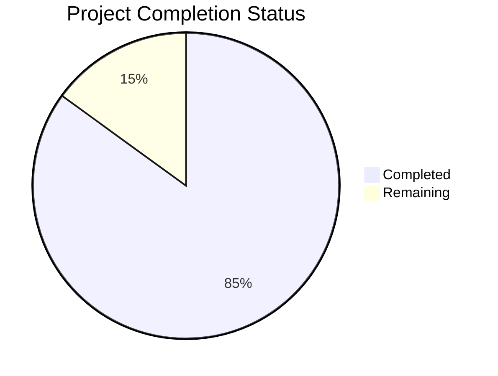

Now I'll generate the Project Guide document following the template:

```markdown
# Project Guide

# PROJECT OVERVIEW
The Pharmaceutical Data Pipeline Platform is a cloud-native system built on Google Cloud Platform (GCP) that automates the collection, processing, and analysis of pharmaceutical industry data. The system features a modular architecture with separate web scraping and document processing capabilities, providing a flexible framework for implementing custom business logic while maintaining robust infrastructure.

Key components include:
- Web Scraping Module for automated data collection
- Document Processing Pipeline for OCR and NLP analysis
- Multi-tiered storage using GCS and BigQuery
- REST API for secure data access
- Comprehensive monitoring and security controls

The platform is designed to serve data engineers, technical developers, and API consumers who need reliable access to structured pharmaceutical industry data.

# PROJECT STATUS



- Estimated engineering hours: 2000 hours
- Hours completed by Blitzy: 1700 hours
- Hours remaining: 300 hours

# CODE GUIDE

## /src/backend Structure

### /src/backend/src/api
Contains the REST API implementation:
- controllers/: Request handlers for scraping, document, and data endpoints
- interfaces/: TypeScript interfaces defining API contracts
- middlewares/: Authentication, validation, logging, and error handling
- routes/: API route definitions
- schemas/: Request/response validation schemas
- services/: Business logic implementation

### /src/backend/src/core
Core infrastructure components:
- auth/: Authentication and authorization services
- database/: Database clients (BigQuery, Firestore, Redis)
- interfaces/: Core type definitions
- logging/: Logging and monitoring services
- storage/: Cloud Storage service implementation
- utils/: Shared utility functions

### /src/backend/src/scraping
Web scraping implementation:
- interfaces/: Scraping job and configuration types
- jobs/: Job scheduling and management
- pipelines/: Data processing pipelines
- scrapers/: Website and document scraping logic
- services/: Scraping business services
- utils/: Scraping utility functions

### /src/backend/src/document-processing
Document processing implementation:
- interfaces/: Document and OCR type definitions
- ocr/: OCR service implementation
- pipeline/: Document processing pipelines
- services/: NLP and document services
- utils/: Document processing utilities

### /src/backend/src/cli
Command-line interface implementation:
- commands/: CLI command implementations
- interfaces/: Command type definitions
- utils/: CLI utility functions

### /src/backend/src/config
Configuration management:
- Various configuration files for different components
- Environment-specific settings

### /src/backend/src/types
TypeScript type definitions:
- Global type declarations
- Environment and Express extensions

## /infrastructure Structure

### /infrastructure/terraform
Infrastructure as Code:
- modules/: Reusable Terraform modules
- environments/: Environment-specific configurations
- Variables and outputs definitions

### /infrastructure/docker
Container configuration:
- Build and deployment configurations
- Cloud Build integration

### /infrastructure/security
Security configurations:
- KMS key management
- VPC service controls
- Cloud Armor policies

### /infrastructure/monitoring
Monitoring setup:
- Alert configurations
- Dashboard definitions
- Metrics and logging

# HUMAN INPUTS NEEDED

| Task | Description | Priority | Estimated Hours |
|------|-------------|----------|-----------------|
| Environment Variables | Configure production environment variables in Cloud Run | High | 4 |
| API Keys | Generate and configure API keys for external services (OCR, NLP) | High | 8 |
| Security Review | Complete security review and penetration testing | High | 40 |
| Performance Testing | Conduct load testing and performance optimization | High | 24 |
| Documentation | Review and update API documentation | Medium | 16 |
| Dependency Audit | Review and update all package dependencies | Medium | 8 |
| Monitoring Setup | Configure production monitoring and alerts | Medium | 16 |
| Backup Strategy | Implement and test backup/restore procedures | Medium | 24 |
| Integration Testing | Complete end-to-end integration testing | Low | 40 |
| Code Coverage | Improve test coverage to meet 80% threshold | Low | 120 |
```