# Technical Specifications

# 1. INTRODUCTION

## 1.1 Executive Summary

The Pharmaceutical Data Pipeline Platform is a cloud-native system designed to automate the collection, processing, and analysis of pharmaceutical industry data from multiple sources. Built on Google Cloud Platform (GCP), the system provides a modular framework that separates web scraping and document processing capabilities, allowing for custom implementation of specific business logic while maintaining a robust and scalable infrastructure.

This platform addresses the critical need for automated data collection from pharmaceutical companies by providing a flexible, maintainable architecture that can adapt to changing data sources and processing requirements. The system will serve data engineers, technical developers, and API consumers who need reliable access to structured pharmaceutical industry data.

## 1.2 System Overview

### Project Context

| Aspect | Description |
|--------|-------------|
| Business Context | Enable automated collection and processing of pharmaceutical industry data |
| Market Position | Infrastructure-focused solution with customizable data processing capabilities |
| Technical Landscape | Cloud-native architecture leveraging GCP services |
| Integration Points | Standalone system with REST API access for external consumers |

### High-Level Description

| Component | Purpose |
|-----------|----------|
| Web Scraping Module | Template-based framework for implementing custom scraping logic |
| Document Processing Pipeline | Independent system for OCR and NLP processing |
| Data Storage Layer | Multi-tiered storage utilizing GCS and BigQuery |
| REST API | Secure data access and retrieval interface |
| Automation Framework | Scheduled execution of data collection tasks |

### Success Criteria

| Category | Metrics |
|----------|----------|
| Performance | - API response time < 500ms for 95% of requests<br>- Document processing time < 2 minutes per document<br>- 99.9% system uptime |
| Scalability | - Support for 100+ concurrent users<br>- Handle 10x data volume increase<br>- Process 100+ documents per hour |
| Reliability | - Error rate < 0.1% for critical operations<br>- 100% data consistency<br>- Recovery time < 1 hour |

## 1.3 Scope

### In-Scope Elements

| Category | Components |
|----------|------------|
| Core Features | - Modular web scraping framework<br>- Document processing pipeline<br>- Data transformation services<br>- REST API access |
| Infrastructure | - GCP service deployment<br>- Automated scaling<br>- Monitoring and logging<br>- Data backup and recovery |
| Security | - API authentication<br>- Data encryption<br>- Access control<br>- Audit logging |
| Automation | - Scheduled data collection<br>- Automated processing<br>- Error handling and retries |

### Implementation Boundaries

| Boundary Type | Coverage |
|---------------|----------|
| System | GCP cloud infrastructure and services |
| Users | Technical developers, data engineers, API consumers |
| Data Domains | Pharmaceutical company websites, regulatory documents |
| Geographic | Global deployment with regional compliance |

### Out-of-Scope Elements

| Category | Excluded Items |
|----------|----------------|
| Features | - Specific scraping logic implementation<br>- Custom OCR/NLP algorithms<br>- Frontend user interface<br>- Business intelligence reporting |
| Technical | - On-premises deployment<br>- Real-time processing<br>- Data visualization<br>- Mobile applications |
| Support | - End-user training<br>- Custom reporting tools<br>- Data analysis services<br>- Business process consulting |

# 2. SYSTEM ARCHITECTURE

## 2.1 High-Level Architecture

```mermaid
C4Context
    title System Context Diagram (Level 0)

    Person(dev, "Technical Developer", "Implements custom scraping and processing logic")
    Person(eng, "Data Engineer", "Monitors and maintains data pipelines")
    Person(consumer, "API Consumer", "Retrieves processed data")

    System_Boundary(pharma_pipeline, "Pharmaceutical Data Pipeline Platform") {
        System(scraping, "Web Scraping Module", "Collects data from pharmaceutical websites")
        System(doc_process, "Document Processing Module", "Processes regulatory documents")
        System(data_access, "Data Access Layer", "Provides API access to processed data")
    }

    System_Ext(pharma_sites, "Pharmaceutical Websites", "External data sources")
    System_Ext(ext_apis, "External APIs", "Third-party data providers")

    Rel(dev, pharma_pipeline, "Implements custom logic")
    Rel(eng, pharma_pipeline, "Monitors and maintains")
    Rel(consumer, data_access, "Queries data via REST API")
    Rel(scraping, pharma_sites, "Scrapes data")
    Rel(scraping, ext_apis, "Retrieves data")
```

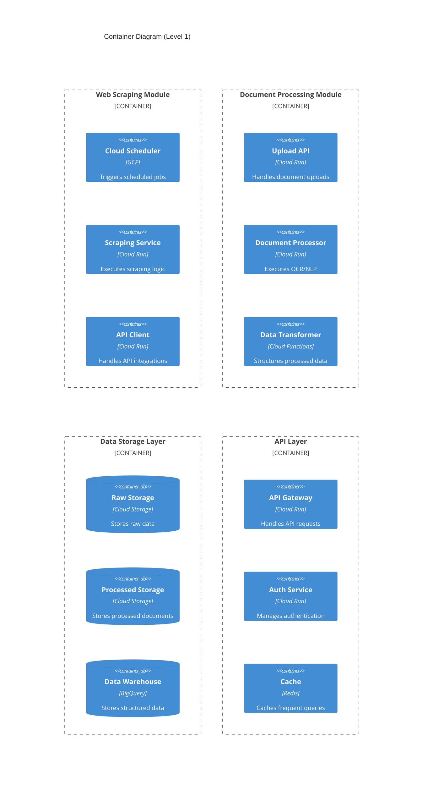

## 2.2 Component Details

### 2.2.1 Web Scraping Module

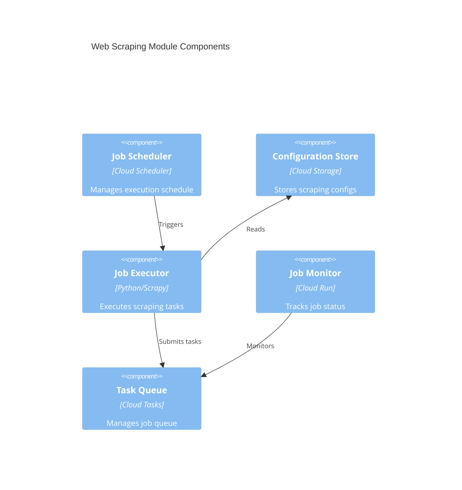

| Component | Technology | Purpose | Scaling Strategy |
|-----------|------------|---------|------------------|
| Job Scheduler | Cloud Scheduler | Automated task execution | N/A - Managed service |
| Job Executor | Cloud Run | Scraping logic execution | Horizontal auto-scaling |
| Configuration Store | Cloud Storage | Scraping templates | N/A - Object storage |
| Task Queue | Cloud Tasks | Job management | Auto-scaling queue |
| Job Monitor | Cloud Run | Status tracking | Horizontal auto-scaling |

### 2.2.2 Document Processing Module


| Component | Technology | Purpose | Scaling Strategy |
|-----------|------------|---------|------------------|
| Upload Handler | Cloud Run | Document ingestion | Horizontal auto-scaling |
| OCR Engine | Cloud Run | Text extraction | Horizontal auto-scaling |
| NLP Processor | Cloud Run | Text analysis | Horizontal auto-scaling |
| Data Transformer | Cloud Functions | Data structuring | Auto-scaling functions |
| Data Validator | Cloud Functions | Quality assurance | Auto-scaling functions |

## 2.3 Technical Decisions

### 2.3.1 Architecture Patterns

| Pattern | Implementation | Justification |
|---------|----------------|---------------|
| Microservices | Containerized services | Independent scaling and deployment |
| Event-driven | Cloud Pub/Sub | Asynchronous processing |
| API Gateway | Cloud Run | Centralized API management |
| CQRS | Separate read/write paths | Optimized query performance |

### 2.3.2 Data Flow Patterns

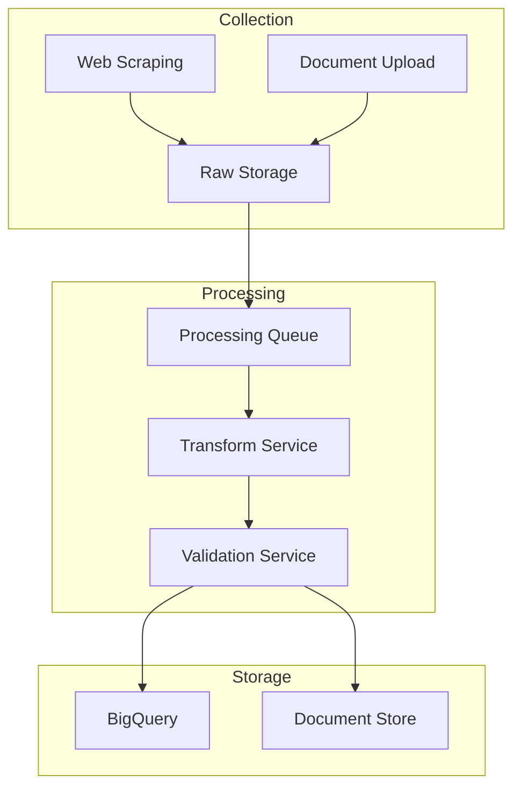

## 2.4 Cross-Cutting Concerns

### 2.4.1 Monitoring and Observability

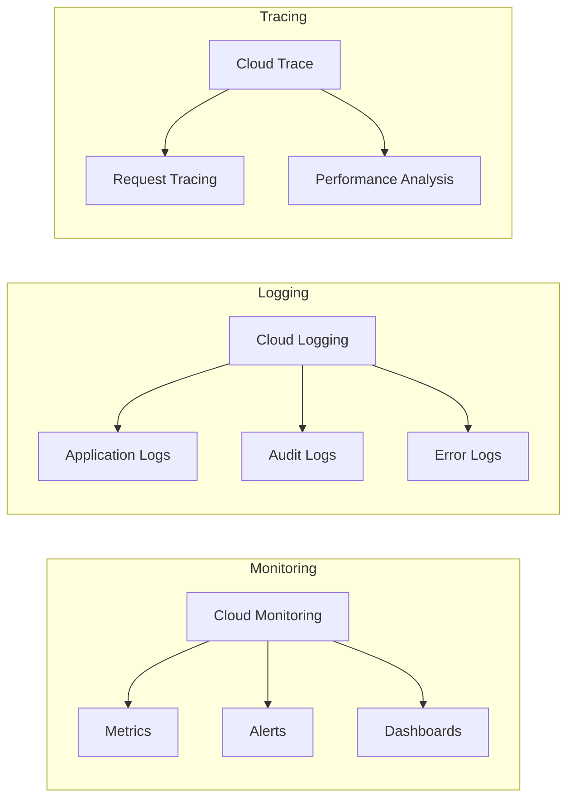

### 2.4.2 Security Architecture

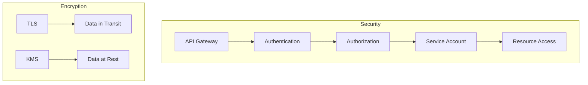

### 2.4.3 Deployment Architecture

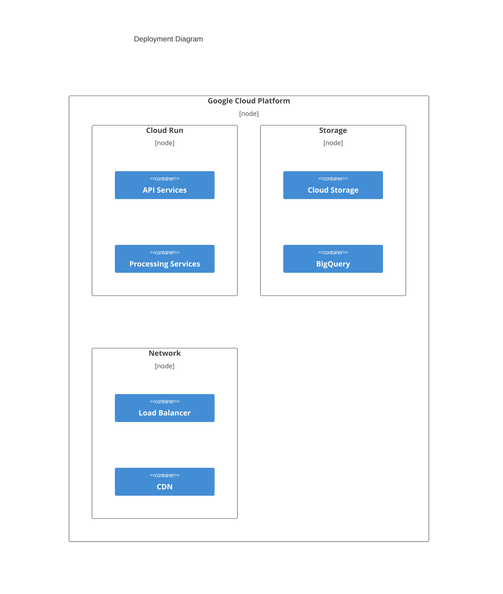

# 3. SYSTEM COMPONENTS ARCHITECTURE

## 3.1 Command Line Interface Design

### 3.1.1 Command Structure

| Command Category | Base Command | Subcommands | Description |
|-----------------|--------------|-------------|-------------|
| Scraping | `scrape` | `start`, `stop`, `status` | Control web scraping jobs |
| Documents | `docs` | `upload`, `process`, `status` | Manage document processing |
| Data | `data` | `export`, `query`, `validate` | Data management operations |
| Config | `config` | `set`, `get`, `list` | System configuration |
| Monitor | `monitor` | `logs`, `metrics`, `alerts` | System monitoring |

### 3.1.2 Input/Output Specifications

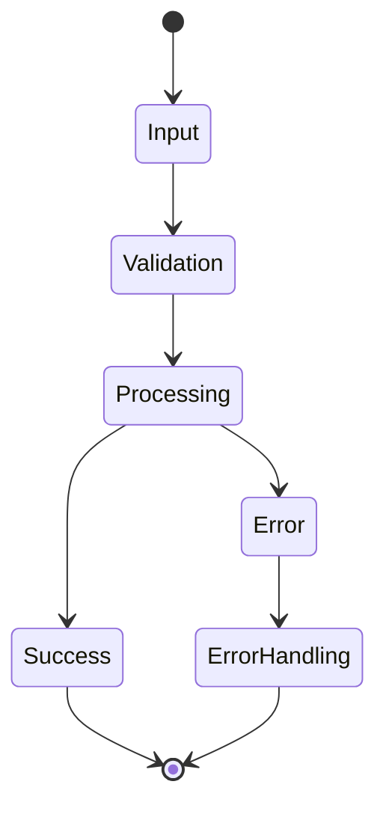

| Component | Format | Example |
|-----------|---------|---------|
| Input | JSON/YAML | `--config config.yaml` |
| Output | Structured Text | `[INFO] Processing complete` |
| Errors | Color-coded Text | `[ERROR] Invalid configuration` |
| Progress | Progress Bar | `[=====>    ] 50%` |

## 3.2 Database Design

### 3.2.1 Schema Design

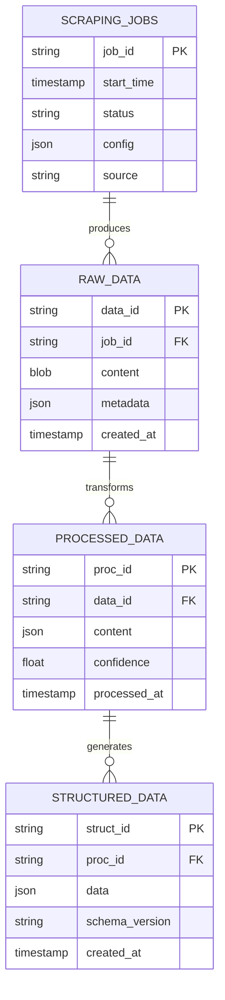

### 3.2.2 Storage Strategy

| Storage Type | Service | Purpose | Retention |
|--------------|---------|----------|-----------|
| Raw Data | Cloud Storage | Original content | 90 days |
| Processed Data | BigQuery | Structured data | 1 year |
| Metadata | Cloud Firestore | Job tracking | 30 days |
| Archive | Cloud Storage Archive | Long-term storage | 7 years |

### 3.2.3 Data Management

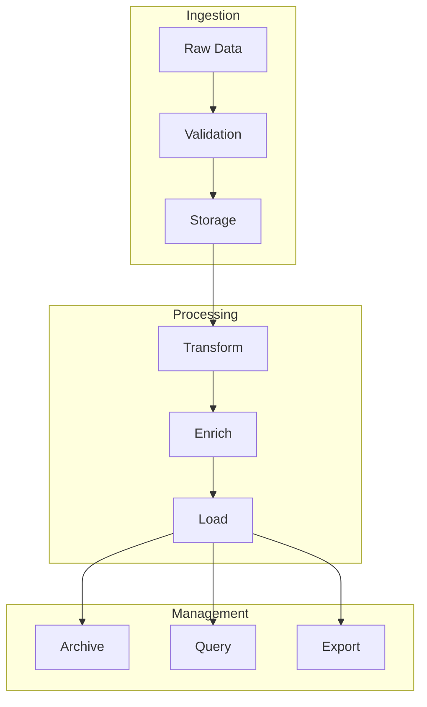

## 3.3 API Design

### 3.3.1 REST API Specifications

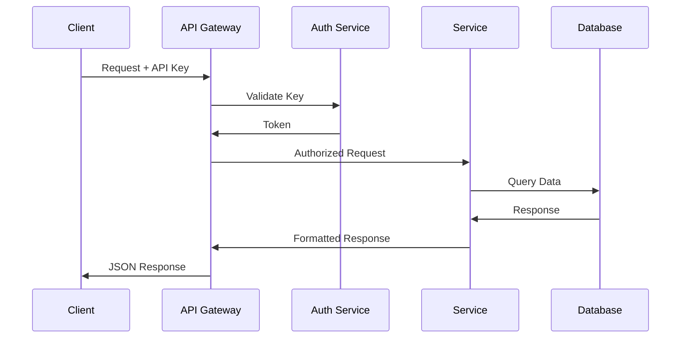

### 3.3.2 Endpoint Definitions

| Endpoint | Method | Purpose | Authentication |
|----------|---------|----------|----------------|
| `/api/v1/scrape` | POST | Start scraping job | API Key |
| `/api/v1/documents` | POST | Upload document | API Key |
| `/api/v1/data` | GET | Query processed data | API Key |
| `/api/v1/export` | POST | Export dataset | API Key |
| `/api/v1/status` | GET | System status | API Key |

### 3.3.3 Authentication Flow

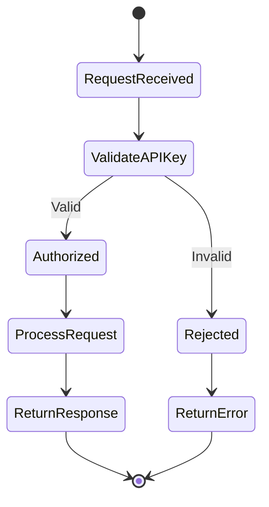

### 3.3.4 Response Formats

| Status | Format | Example |
|--------|--------|---------|
| Success | `{"status": "success", "data": {}}` | `{"status": "success", "data": {"job_id": "123"}}` |
| Error | `{"status": "error", "message": ""}` | `{"status": "error", "message": "Invalid API key"}` |
| Progress | `{"status": "progress", "percent": 0}` | `{"status": "progress", "percent": 50}` |

### 3.3.5 Integration Patterns

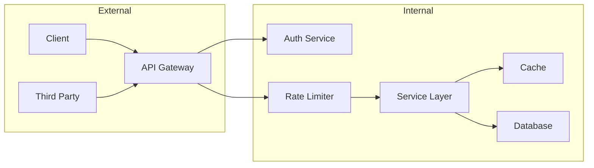

### 3.3.6 Security Controls

| Control | Implementation | Purpose |
|---------|----------------|----------|
| Authentication | API Key + JWT | Identity verification |
| Authorization | Role-based | Access control |
| Rate Limiting | Token bucket | Prevent abuse |
| Encryption | TLS 1.3 | Data protection |
| Validation | JSON Schema | Input validation |

# 4. TECHNOLOGY STACK

## 4.1 PROGRAMMING LANGUAGES

| Language | Version | Component | Justification |
|----------|---------|-----------|---------------|
| Python | 3.9+ | Backend Services | - Native GCP library support<br>- Rich ecosystem for web scraping and NLP<br>- Strong async capabilities for API integration |
| Go | 1.19+ | Performance-critical services | - High performance for data processing<br>- Excellent concurrency support<br>- Native GCP integration |
| SQL | Standard | Data queries | - BigQuery compatibility<br>- Standard data manipulation |

## 4.2 FRAMEWORKS & LIBRARIES

### Core Frameworks

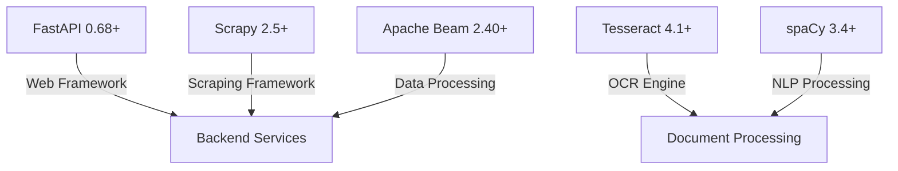

| Framework | Version | Purpose | Justification |
|-----------|---------|---------|---------------|
| FastAPI | 0.68+ | API Development | - High performance async support<br>- Automatic OpenAPI documentation<br>- Native Pydantic integration |
| Scrapy | 2.5+ | Web Scraping | - Robust scraping framework<br>- Built-in middleware support<br>- Extensible architecture |
| Apache Beam | 2.40+ | Data Processing | - Native GCP Dataflow support<br>- Scalable data processing<br>- Batch and streaming support |

### Supporting Libraries

| Category | Libraries | Purpose |
|----------|-----------|---------|
| Data Processing | - pandas 1.4+<br>- numpy 1.21+ | Data manipulation and analysis |
| Cloud Integration | - google-cloud-storage 2.0+<br>- google-cloud-bigquery 3.0+ | GCP service integration |
| Monitoring | - prometheus-client 0.14+<br>- opentelemetry-api 1.12+ | System metrics and tracing |

## 4.3 DATABASES & STORAGE

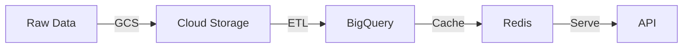

### Storage Strategy

| Layer | Technology | Purpose | Characteristics |
|-------|------------|---------|-----------------|
| Raw Storage | Cloud Storage | Document and raw data storage | - Object storage<br>- Versioning enabled<br>- Lifecycle management |
| Data Warehouse | BigQuery | Structured data storage | - Columnar storage<br>- SQL interface<br>- Petabyte scale |
| Cache | Redis 6.2+ | Performance optimization | - In-memory storage<br>- Key-value store<br>- TTL support |

## 4.4 THIRD-PARTY SERVICES

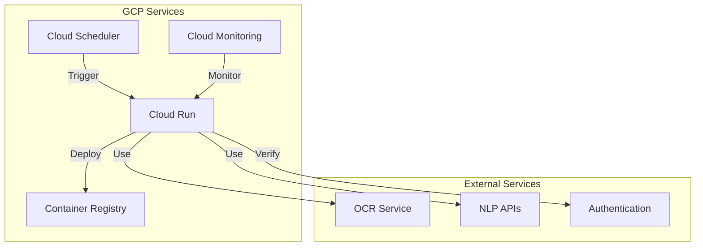

| Service Category | Provider | Purpose | Integration Method |
|-----------------|----------|---------|-------------------|
| Cloud Platform | GCP | Infrastructure | Native APIs |
| Monitoring | Cloud Monitoring | System metrics | Client libraries |
| Logging | Cloud Logging | Centralized logging | Client libraries |
| Authentication | Cloud IAM | Access control | API integration |

## 4.5 DEVELOPMENT & DEPLOYMENT

### Development Tools

| Tool | Version | Purpose |
|------|---------|---------|
| Docker | 20.10+ | Containerization |
| Terraform | 1.3+ | Infrastructure as Code |
| Cloud Build | Latest | CI/CD pipeline |
| Git | 2.30+ | Version control |

### Deployment Pipeline

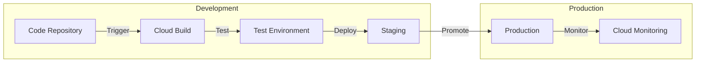

### Container Strategy

| Component | Base Image | Size Constraints | Security |
|-----------|------------|------------------|-----------|
| API Services | python:3.9-slim | < 500MB | Distroless |
| Scrapers | python:3.9-slim | < 1GB | Distroless |
| Document Processors | python:3.9 | < 2GB | Minimal base |

### CI/CD Requirements

| Stage | Tools | Requirements |
|-------|-------|--------------|
| Build | Cloud Build | - Automated testing<br>- Security scanning<br>- Dependency updates |
| Test | pytest, coverage | - 80% code coverage<br>- Integration tests<br>- Performance tests |
| Deploy | Cloud Run | - Zero-downtime deployment<br>- Automated rollback<br>- Version tagging |

# 5. SYSTEM DESIGN

## 5.1 Command Line Interface Design

### 5.1.1 Command Structure

| Command | Subcommand | Options | Description |
|---------|------------|----------|-------------|
| `pharma-pipeline scrape` | `start` | `--config <file>` | Start scraping job |
| | `stop` | `--job-id <id>` | Stop running job |
| | `status` | `--job-id <id>` | Check job status |
| `pharma-pipeline docs` | `upload` | `--file <path>` | Upload document |
| | `process` | `--doc-id <id>` | Process document |
| | `status` | `--doc-id <id>` | Check processing status |
| `pharma-pipeline data` | `export` | `--format <csv/json>` | Export dataset |
| | `query` | `--filter <expr>` | Query data |
| `pharma-pipeline config` | `set` | `--key <key> --value <value>` | Set configuration |
| | `get` | `--key <key>` | Get configuration |

### 5.1.2 Command Flow

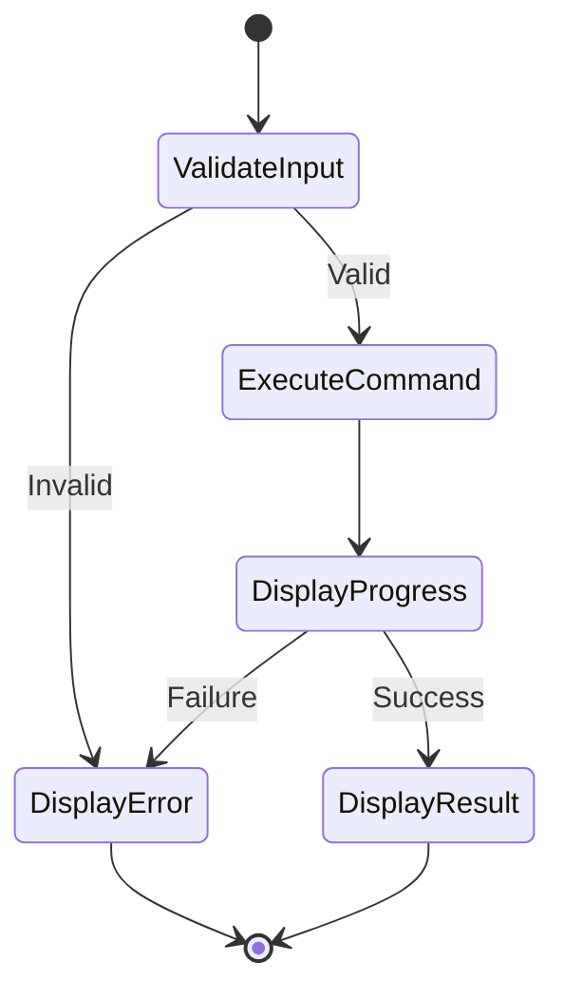

## 5.2 Database Design

### 5.2.1 Logical Data Model

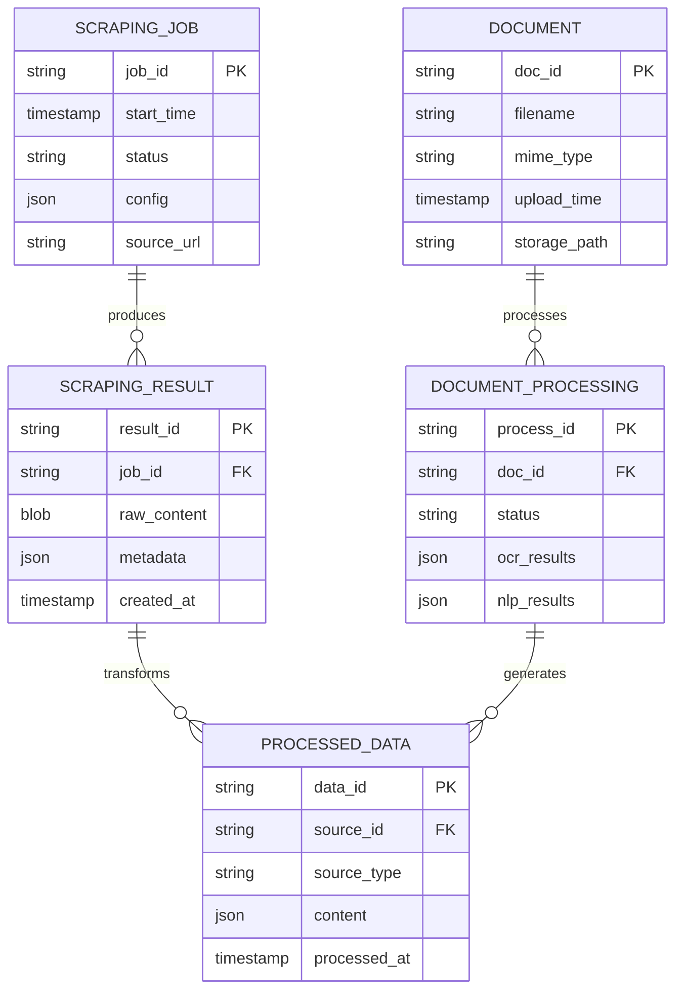

### 5.2.2 Storage Strategy

| Data Type | Storage Service | Schema | Retention |
|-----------|----------------|---------|-----------|
| Raw Scraping Data | Cloud Storage | Blob + Metadata | 90 days |
| Documents | Cloud Storage | Blob + Metadata | 90 days |
| Processed Results | BigQuery | Structured Schema | 1 year |
| Configuration | Cloud Firestore | Document Store | Indefinite |

## 5.3 API Design

### 5.3.1 REST API Endpoints

| Endpoint | Method | Description | Request Body | Response |
|----------|--------|-------------|--------------|-----------|
| `/api/v1/scrape/jobs` | POST | Create scraping job | `{"config": {}, "source": ""}` | `{"job_id": ""}` |
| `/api/v1/scrape/jobs/{id}` | GET | Get job status | - | `{"status": "", "progress": 0}` |
| `/api/v1/documents` | POST | Upload document | `multipart/form-data` | `{"doc_id": ""}` |
| `/api/v1/documents/{id}/process` | POST | Process document | `{"options": {}}` | `{"process_id": ""}` |
| `/api/v1/data` | GET | Query data | Query params | `{"data": [], "pagination": {}}` |

### 5.3.2 API Flow

```mermaid
sequenceDiagram
    participant Client
    participant Gateway
    participant Auth
    participant Service
    participant Storage
    
    Client->>Gateway: API Request
    Gateway->>Auth: Validate API Key
    Auth->>Gateway: Token
    Gateway->>Service: Forward Request
    Service->>Storage: Data Operation
    Storage->>Service: Result
    Service->>Gateway: Response
    Gateway->>Client: JSON Response
```

### 5.3.3 Authentication Flow

```mermaid
flowchart LR
    A[Client] -->|API Key| B[API Gateway]
    B -->|Validate| C[Auth Service]
    C -->|Token| D[Internal Services]
    D -->|Access| E[Resources]
    
    subgraph Security
        C -->|Verify| F[Key Store]
        C -->|Log| G[Audit Log]
    end
```

## 5.4 Integration Architecture

### 5.4.1 Service Integration

```mermaid
flowchart TB
    subgraph External
        A[Web Sources]
        B[External APIs]
    end
    
    subgraph Processing
        C[Scraping Service]
        D[Document Service]
        E[Data Service]
    end
    
    subgraph Storage
        F[Cloud Storage]
        G[BigQuery]
    end
    
    A -->|Scrape| C
    B -->|API| C
    C -->|Store| F
    D -->|Process| F
    F -->|Transform| G
    E -->|Query| G
```

### 5.4.2 Data Flow

| Source | Destination | Protocol | Format | Frequency |
|--------|-------------|----------|---------|-----------|
| Web Scraper | Cloud Storage | HTTPS | JSON/Binary | Real-time |
| Document Upload | Cloud Storage | HTTPS | Binary | Real-time |
| Cloud Storage | BigQuery | Internal | Avro | Batch |
| BigQuery | API | HTTPS | JSON | On-demand |

### 5.4.3 Error Handling

```mermaid
stateDiagram-v2
    [*] --> Operation
    Operation --> Success: Complete
    Operation --> Retry: Recoverable Error
    Operation --> Failure: Fatal Error
    Retry --> Operation: Attempt < Max
    Retry --> Failure: Max Attempts
    Success --> [*]
    Failure --> ErrorLog
    ErrorLog --> Notification
    Notification --> [*]
```

# 6. USER INTERFACE DESIGN

No user interface required. This platform is designed as a backend infrastructure system with API access only. All interactions should be performed through:

1. REST API endpoints for data access and system control
2. Command Line Interface (CLI) for administrative tasks
3. Cloud Console for infrastructure management
4. Monitoring dashboards for system observation

Frontend development and user interface design are explicitly listed as out-of-scope in the project requirements. Client applications and visualization tools can be built separately by consuming the provided APIs.

For API documentation and interaction patterns, please refer to sections:
- 3.3 API Design
- 7.1 Software Interfaces
- 7.2 Communication Interfaces

# 7. SECURITY CONSIDERATIONS

## 7.1 Authentication and Authorization

### 7.1.1 Authentication Flow

```mermaid
sequenceDiagram
    participant Client
    participant Gateway
    participant Auth
    participant KMS
    participant Service
    
    Client->>Gateway: Request + API Key
    Gateway->>Auth: Validate Key
    Auth->>KMS: Decrypt Key
    KMS->>Auth: Validation Result
    Auth->>Gateway: JWT Token
    Gateway->>Service: Forward Request + Token
    Service->>Client: Response
```

### 7.1.2 Authorization Matrix

| Role | Scraping Jobs | Document Processing | Data Access | Configuration |
|------|---------------|---------------------|-------------|---------------|
| Admin | Full Access | Full Access | Full Access | Full Access |
| Developer | Create, Read | Create, Read | Read | Read |
| Data Engineer | Read | Create, Read | Read, Export | Read |
| API Consumer | No Access | No Access | Read (Limited) | No Access |

### 7.1.3 Access Control Implementation

| Component | Method | Implementation |
|-----------|---------|----------------|
| API Gateway | API Key + JWT | Cloud Run Authentication |
| Service-to-Service | Service Accounts | GCP IAM Roles |
| Internal Services | mTLS | Cloud Certificate Authority |
| Data Access | IAM Policies | BigQuery Row-Level Security |

## 7.2 Data Security

### 7.2.1 Encryption Strategy

```mermaid
flowchart TB
    subgraph Data at Rest
        A[Cloud Storage] -->|CMEK| B[KMS Keys]
        C[BigQuery] -->|Column-Level| B
        D[Secrets] -->|Envelope| B
    end
    
    subgraph Data in Transit
        E[TLS 1.3] -->|External| F[API Traffic]
        G[mTLS] -->|Internal| H[Service Mesh]
    end
```

### 7.2.2 Data Protection Measures

| Data Type | Storage Location | Encryption Method | Access Control |
|-----------|-----------------|-------------------|----------------|
| Raw Scraping Data | Cloud Storage | AES-256 + CMEK | IAM + VPC SC |
| Documents | Cloud Storage | AES-256 + CMEK | IAM + VPC SC |
| Processed Data | BigQuery | Column-level | Row-level Security |
| API Keys | Secret Manager | Envelope Encryption | IAM + VPC SC |

### 7.2.3 Data Classification

| Level | Description | Security Controls | Example |
|-------|-------------|-------------------|---------|
| Public | Open Data | Basic Encryption | Public Company Info |
| Internal | Business Data | Encryption + IAM | Processing Results |
| Confidential | Sensitive Data | Full Security Stack | API Keys, Credentials |
| Restricted | Regulated Data | Maximum Security | PII, Financial Data |

## 7.3 Security Protocols

### 7.3.1 Network Security

```mermaid
flowchart LR
    subgraph External
        A[Internet] -->|TLS 1.3| B[Cloud Armor]
    end
    
    subgraph VPC
        B -->|WAF| C[Load Balancer]
        C -->|mTLS| D[Services]
        D -->|Private| E[Data Stores]
    end
```

### 7.3.2 Security Controls

| Control Type | Implementation | Purpose |
|--------------|----------------|----------|
| WAF | Cloud Armor | DDoS Protection, Request Filtering |
| Network | VPC Service Controls | Resource Isolation |
| Identity | Cloud IAM | Access Management |
| Monitoring | Cloud Audit Logs | Security Monitoring |
| Compliance | Security Command Center | Threat Detection |

### 7.3.3 Security Procedures

| Procedure | Frequency | Implementation |
|-----------|-----------|----------------|
| Key Rotation | 90 days | Automated via KMS |
| Security Scanning | Daily | Container/Code Scanning |
| Access Review | Monthly | IAM Policy Review |
| Penetration Testing | Quarterly | External Security Audit |
| Compliance Audit | Annually | SOC 2 Assessment |

### 7.3.4 Incident Response

```mermaid
stateDiagram-v2
    [*] --> Detection
    Detection --> Analysis
    Analysis --> Containment
    Containment --> Eradication
    Eradication --> Recovery
    Recovery --> PostIncident
    PostIncident --> [*]
```

| Phase | Actions | Responsible Team |
|-------|---------|-----------------|
| Detection | Monitor alerts, Log analysis | Security Operations |
| Analysis | Threat assessment, Impact evaluation | Security Team |
| Containment | Isolate affected systems | Operations Team |
| Eradication | Remove threat, Patch vulnerabilities | Security + Dev Teams |
| Recovery | Restore services, Verify security | Operations Team |
| Post-Incident | Review and documentation | All Teams |

# 8. INFRASTRUCTURE

## 8.1 Deployment Environment

The Pharmaceutical Data Pipeline Platform is deployed entirely on Google Cloud Platform (GCP) to leverage its managed services, scalability, and security features.

### Environment Specifications

| Component | Environment | Purpose |
|-----------|-------------|----------|
| Development | GCP Project - Dev | Feature development and testing |
| Staging | GCP Project - Staging | Integration testing and UAT |
| Production | GCP Project - Prod | Live system operation |

### Regional Configuration

```mermaid
flowchart TB
    subgraph Primary Region
        A[us-central1] --> B[Cloud Run Services]
        A --> C[BigQuery]
        A --> D[Cloud Storage]
    end
    
    subgraph DR Region
        E[us-east1] --> F[Cloud Run Services]
        E --> G[Cloud Storage]
    end
    
    subgraph Global
        H[Load Balancer]
        I[Cloud CDN]
        J[Cloud Armor]
    end
    
    H --> A
    H --> E
```

## 8.2 Cloud Services

### Core GCP Services

| Service | Usage | Justification |
|---------|--------|---------------|
| Cloud Run | Service hosting | - Serverless container platform<br>- Auto-scaling<br>- Pay-per-use pricing |
| Cloud Storage | Data storage | - Object storage for documents<br>- Lifecycle management<br>- Versioning support |
| BigQuery | Data warehouse | - Serverless analytics<br>- SQL interface<br>- High performance |
| Cloud Scheduler | Job automation | - Cron job management<br>- Reliable triggering<br>- Native integration |
| Cloud Monitoring | System monitoring | - Comprehensive metrics<br>- Custom dashboards<br>- Alert management |

### Supporting Services

| Service | Purpose | Configuration |
|---------|----------|--------------|
| Cloud Build | CI/CD pipeline | - Docker build automation<br>- Test execution<br>- Deployment automation |
| Cloud KMS | Key management | - Encryption key management<br>- Secret rotation<br>- Access control |
| Cloud Armor | Security | - DDoS protection<br>- WAF rules<br>- IP allowlisting |
| VPC | Network isolation | - Private service access<br>- Network policies<br>- Service perimeter |

## 8.3 Containerization

### Container Strategy

```mermaid
graph TB
    subgraph Base Images
        A[python:3.9-slim] --> B[Scraping Service]
        A --> C[Processing Service]
        A --> D[API Service]
    end
    
    subgraph Security
        E[Distroless] --> F[Production Images]
        G[Vulnerability Scan] --> F
    end
    
    subgraph Registry
        F --> H[Artifact Registry]
        H --> I[Cloud Run]
    end
```

### Container Specifications

| Service | Base Image | Size Limit | Security Features |
|---------|------------|------------|-------------------|
| Scraping Service | python:3.9-slim | 500MB | - No shell access<br>- Read-only filesystem<br>- Non-root user |
| Processing Service | python:3.9-slim | 1GB | - No shell access<br>- Read-only filesystem<br>- Non-root user |
| API Service | python:3.9-slim | 300MB | - No shell access<br>- Read-only filesystem<br>- Non-root user |

## 8.4 Orchestration

Cloud Run handles container orchestration with its managed platform, eliminating the need for Kubernetes complexity.

### Service Configuration

```mermaid
flowchart LR
    subgraph Cloud Run
        A[Load Balancer] --> B[Service Revision]
        B --> C[Container Instance 1]
        B --> D[Container Instance 2]
        B --> E[Container Instance N]
    end
    
    subgraph Scaling
        F[CPU Utilization]
        G[Concurrent Requests]
        H[Custom Metrics]
    end
    
    F --> B
    G --> B
    H --> B
```

### Scaling Parameters

| Service | Min Instances | Max Instances | CPU Limit | Memory Limit |
|---------|--------------|---------------|-----------|--------------|
| Scraping Service | 0 | 10 | 2 vCPU | 4GB |
| Processing Service | 1 | 20 | 4 vCPU | 8GB |
| API Service | 2 | 30 | 2 vCPU | 4GB |

## 8.5 CI/CD Pipeline

### Pipeline Architecture

```mermaid
flowchart LR
    subgraph Source
        A[GitHub Repository] --> B[Cloud Build Trigger]
    end
    
    subgraph Build
        B --> C[Run Tests]
        C --> D[Build Container]
        D --> E[Security Scan]
    end
    
    subgraph Deploy
        E --> F[Push to Registry]
        F --> G[Deploy Staging]
        G --> H[Integration Tests]
        H --> I[Deploy Production]
    end
```

### Pipeline Stages

| Stage | Tools | Actions | Success Criteria |
|-------|-------|---------|------------------|
| Source Control | GitHub | - Code commit<br>- Branch protection<br>- Code review | - Approved PR<br>- Passing checks |
| Build | Cloud Build | - Unit tests<br>- Container build<br>- Security scan | - All tests pass<br>- No vulnerabilities |
| Test | pytest, coverage | - Integration tests<br>- Coverage check<br>- Performance tests | - 80% coverage<br>- API tests pass |
| Deploy | Cloud Run | - Rolling update<br>- Health check<br>- Traffic migration | - Zero downtime<br>- Health check pass |

### Deployment Configuration

| Environment | Deployment Strategy | Rollback Strategy | Monitoring |
|-------------|-------------------|-------------------|------------|
| Development | Direct deployment | Manual rollback | Basic health checks |
| Staging | Blue/Green | Automatic rollback | Full monitoring |
| Production | Progressive rollout | Automatic rollback | Full monitoring + alerts |

# 8. APPENDICES

## 8.1 Additional Technical Information

### Development Environment Setup

```mermaid
flowchart LR
    subgraph Local Development
        A[VS Code] -->|Python Extension| B[Python 3.9+]
        B -->|Virtual Environment| C[Dependencies]
        C -->|Docker| D[Local Testing]
    end
    
    subgraph Cloud Development
        D -->|Cloud Build| E[Development]
        E -->|Testing| F[Staging]
        F -->|Promotion| G[Production]
    end
```

### Error Handling Strategy

| Error Type | Retry Strategy | Logging Level | Alert Threshold |
|------------|----------------|---------------|-----------------|
| Network Timeout | Exponential backoff, max 3 retries | WARNING | 5/minute |
| API Rate Limit | Wait period + retry, max 5 attempts | WARNING | 10/minute |
| Authentication | No retry | ERROR | 3/minute |
| Data Validation | No retry | ERROR | 5/minute |
| System Error | Circuit breaker after 3 failures | CRITICAL | 1/minute |

### Data Retention Policies

| Data Type | Active Storage | Archive Storage | Deletion Policy |
|-----------|----------------|-----------------|-----------------|
| Raw Scraping Data | 90 days | 1 year | Automated purge |
| Processed Documents | 180 days | 2 years | Manual approval |
| System Logs | 30 days | 1 year | Automated purge |
| Audit Trails | 1 year | 7 years | Compliance-based |
| API Access Logs | 90 days | 1 year | Automated purge |

## 8.2 GLOSSARY

| Term | Definition |
|------|------------|
| Artifact Registry | GCP service for storing and managing container images and packages |
| Blue/Green Deployment | Deployment strategy using two identical environments for zero-downtime updates |
| CMEK | Customer-managed encryption keys for data protection in GCP |
| Data Lineage | Tracking of data movement and transformation through the system |
| Dead Letter Queue | Storage for failed message processing attempts |
| Envelope Encryption | Process of encrypting data encryption keys with a master key |
| IAM | Identity and Access Management system in GCP |
| Idempotency | Property where an operation produces the same result regardless of repetition |
| Service Mesh | Infrastructure layer for service-to-service communication |
| VPC Service Controls | Security perimeter around GCP resources |

## 8.3 ACRONYMS

| Acronym | Full Form |
|---------|-----------|
| API | Application Programming Interface |
| CMEK | Customer-Managed Encryption Keys |
| CPU | Central Processing Unit |
| CSV | Comma-Separated Values |
| ETL | Extract, Transform, Load |
| GCP | Google Cloud Platform |
| GCS | Google Cloud Storage |
| IAM | Identity and Access Management |
| JSON | JavaScript Object Notation |
| JWT | JSON Web Token |
| KMS | Key Management Service |
| mTLS | Mutual Transport Layer Security |
| NLP | Natural Language Processing |
| OCR | Optical Character Recognition |
| PDF | Portable Document Format |
| PII | Personally Identifiable Information |
| RAM | Random Access Memory |
| REST | Representational State Transfer |
| SLA | Service Level Agreement |
| SQL | Structured Query Language |
| SSL | Secure Sockets Layer |
| TLS | Transport Layer Security |
| URL | Uniform Resource Locator |
| UTF | Unicode Transformation Format |
| VPC | Virtual Private Cloud |
| XML | Extensible Markup Language |

## 8.4 Reference Architecture

```mermaid
C4Context
    title System Reference Architecture

    System_Boundary(sys, "Pharmaceutical Data Pipeline") {
        Container(web, "Web Scraping Module", "Python, Scrapy")
        Container(doc, "Document Processing", "Python, OCR/NLP")
        Container(api, "REST API", "FastAPI")
        ContainerDb(store, "Data Storage", "GCS, BigQuery")
    }

    System_Ext(ext_web, "External Websites")
    System_Ext(ext_api, "External APIs")
    System_Ext(clients, "API Clients")

    Rel(web, ext_web, "Scrapes")
    Rel(web, ext_api, "Calls")
    Rel(web, store, "Stores")
    Rel(doc, store, "Processes")
    Rel(api, store, "Queries")
    Rel(clients, api, "Consumes")
```