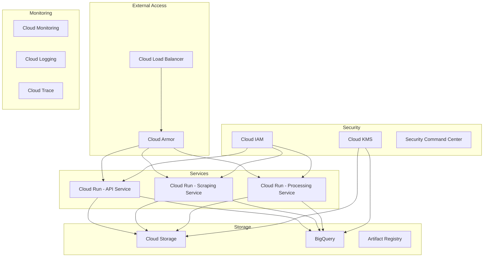

# Pharmaceutical Data Pipeline Platform Infrastructure Documentation

## Table of Contents
1. [Infrastructure Overview](#infrastructure-overview)
2. [Prerequisites](#prerequisites)
3. [Environment Setup](#environment-setup)
4. [Terraform Configuration](#terraform-configuration)
5. [CI/CD Pipeline](#cicd-pipeline)
6. [Monitoring and Alerts](#monitoring-and-alerts)
7. [Security Configuration](#security-configuration)
8. [Maintenance Procedures](#maintenance-procedures)

## Infrastructure Overview

The Pharmaceutical Data Pipeline Platform is built on Google Cloud Platform (GCP) using cloud-native services for maximum scalability, reliability, and security.

### Architecture Diagram



### Core Components

| Component | Service | Purpose |
|-----------|---------|----------|
| API Service | Cloud Run | RESTful API endpoint handling |
| Scraping Service | Cloud Run | Web scraping orchestration |
| Processing Service | Cloud Run | Document processing and analysis |
| Object Storage | Cloud Storage | Raw data and document storage |
| Data Warehouse | BigQuery | Structured data storage |
| Container Registry | Artifact Registry | Container image storage |

## Prerequisites

### Required Tools
- gcloud CLI (v400.0.0+)
- Terraform (v1.3.0+)
- Docker (v20.10.0+)
- Python (v3.9+)

### Required Permissions
```bash
# Required IAM Roles
roles/owner                  # Project Owner
roles/cloudbuild.builds.editor
roles/cloudkms.admin
roles/cloudfunctions.admin
roles/cloudrun.admin
roles/bigquery.admin
roles/storage.admin
```

### Project Setup
```bash
# Initialize GCP project
export PROJECT_ID="pharma-pipeline-prod"
gcloud projects create $PROJECT_ID

# Enable required APIs
gcloud services enable \
    cloudrun.googleapis.com \
    cloudbuild.googleapis.com \
    containerregistry.googleapis.com \
    bigquery.googleapis.com \
    cloudkms.googleapis.com \
    monitoring.googleapis.com \
    logging.googleapis.com
```

## Environment Setup

### Development Environment
```bash
# Create development environment
terraform workspace new dev
terraform init
terraform apply -var-file=environments/dev.tfvars
```

### Staging Environment
```bash
# Create staging environment
terraform workspace new staging
terraform init
terraform apply -var-file=environments/staging.tfvars
```

### Production Environment
```bash
# Create production environment
terraform workspace new prod
terraform init
terraform apply -var-file=environments/prod.tfvars
```

## Terraform Configuration

### Resource Organization
```hcl
# Example main.tf structure
module "networking" {
  source = "./modules/networking"
  project_id = var.project_id
  region = var.region
}

module "storage" {
  source = "./modules/storage"
  project_id = var.project_id
  bucket_location = var.region
}

module "services" {
  source = "./modules/services"
  project_id = var.project_id
  region = var.region
  container_image = var.api_image
}
```

### State Management
```bash
# Initialize backend
terraform init \
    -backend-config="bucket=${PROJECT_ID}-terraform-state" \
    -backend-config="prefix=terraform/state"
```

## CI/CD Pipeline

### Build Configuration
```yaml
# Example cloud-build.yaml
steps:
  - name: 'gcr.io/cloud-builders/docker'
    args: ['build', '-t', 'gcr.io/$PROJECT_ID/api-service', './api']
    
  - name: 'gcr.io/cloud-builders/docker'
    args: ['push', 'gcr.io/$PROJECT_ID/api-service']
    
  - name: 'gcr.io/cloud-builders/gcloud'
    args: ['run', 'deploy', 'api-service',
           '--image', 'gcr.io/$PROJECT_ID/api-service',
           '--region', '${_REGION}',
           '--platform', 'managed']
```

### Security Scanning
```yaml
steps:
  - name: 'gcr.io/cloud-builders/docker'
    args: ['build', '-t', 'gcr.io/$PROJECT_ID/api-service', './api']
    
  - name: 'gcr.io/cloud-builders/gcloud'
    args: ['container', 'images', 'scan',
           'gcr.io/$PROJECT_ID/api-service',
           '--format=json']
```

## Monitoring and Alerts

### Dashboard Configuration
```json
{
  "displayName": "API Service Dashboard",
  "gridLayout": {
    "columns": "2",
    "widgets": [
      {
        "title": "Request Latency",
        "xyChart": {
          "dataSets": [{
            "timeSeriesQuery": {
              "metric": "run.googleapis.com/request_latencies"
            }
          }]
        }
      }
    ]
  }
}
```

### Alert Configuration
```yaml
# Example alert policy
displayName: "High Error Rate Alert"
combiner: OR
conditions:
  - displayName: "Error Rate > 1%"
    conditionThreshold:
      filter: "metric.type=\"run.googleapis.com/request_count\""
      aggregations:
        - alignmentPeriod: 60s
          perSeriesAligner: ALIGN_RATE
          crossSeriesReducer: REDUCE_SUM
      thresholdValue: 0.01
```

## Security Configuration

### Encryption Configuration
```hcl
# Example KMS configuration
resource "google_kms_key_ring" "key_ring" {
  name     = "pharma-pipeline-keyring"
  location = "global"
}

resource "google_kms_crypto_key" "crypto_key" {
  name     = "data-encryption-key"
  key_ring = google_kms_key_ring.key_ring.id
  rotation_period = "7776000s"  # 90 days
}
```

### Network Security
```hcl
# Example VPC configuration
resource "google_compute_network" "vpc" {
  name                    = "pharma-pipeline-vpc"
  auto_create_subnetworks = false
}

resource "google_compute_subnetwork" "subnet" {
  name          = "services-subnet"
  ip_cidr_range = "10.0.0.0/24"
  network       = google_compute_network.vpc.id
  region        = var.region
}
```

## Maintenance Procedures

### Backup Procedures
```bash
# Backup BigQuery datasets
bq extract \
    --destination_format=AVRO \
    --compression=SNAPPY \
    "${PROJECT_ID}:dataset.table" \
    "gs://${BACKUP_BUCKET}/backups/$(date +%Y%m%d)/*.avro"
```

### Update Procedures
```bash
# Update infrastructure
terraform plan -out=tfplan
terraform apply tfplan

# Update services
gcloud run services update api-service \
    --image=gcr.io/${PROJECT_ID}/api-service:${NEW_VERSION}
```

### Disaster Recovery
```bash
# Restore from backup
bq load \
    --source_format=AVRO \
    "${PROJECT_ID}:dataset.table" \
    "gs://${BACKUP_BUCKET}/backups/${BACKUP_DATE}/*.avro"
```

## Version History

| Version | Date | Changes |
|---------|------|---------|
| 1.0.0 | 2023-10-01 | Initial release |
| 1.1.0 | 2023-11-01 | Added security configurations |
| 1.2.0 | 2023-12-01 | Updated monitoring setup |

## Contact Information

- DevOps Team Lead: devops-lead@company.com
- Security Team Lead: security-lead@company.com
- Cloud Infrastructure Engineer: cloud-eng@company.com