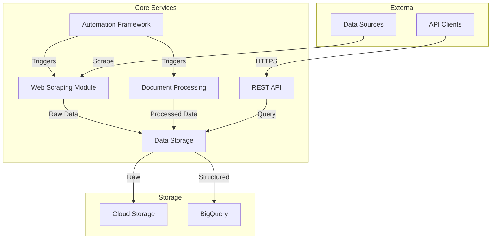

# Pharmaceutical Data Pipeline Platform - Backend Services

## Overview

The Pharmaceutical Data Pipeline Platform is a cloud-native system designed to automate the collection, processing, and analysis of pharmaceutical industry data. This repository contains the backend services implementation built on Google Cloud Platform (GCP).

## System Requirements

- Python 3.9+
- Docker 20.10+
- Google Cloud SDK
- Virtual Environment
- Git 2.30+

## Architecture Overview



### Core Components

| Component | Technology | Purpose |
|-----------|------------|----------|
| Web Scraping Module | Python/Scrapy | Data collection from pharmaceutical sources |
| Document Processing | OCR/NLP Services | Document analysis and text extraction |
| Data Storage Layer | GCS/BigQuery | Multi-tiered data storage solution |
| REST API | FastAPI | Data access and system control |
| Automation Framework | Cloud Scheduler | Scheduled task execution |

## Getting Started

### Prerequisites

1. Install required system dependencies:
```bash
# Python 3.9+ installation
sudo apt update
sudo apt install python3.9 python3.9-venv

# Docker installation
curl -fsSL https://get.docker.com -o get-docker.sh
sudo sh get-docker.sh

# Google Cloud SDK
curl https://sdk.cloud.google.com | bash
gcloud init
```

### Installation

1. Clone the repository:
```bash
git clone <repository-url>
cd src/backend
```

2. Create and activate virtual environment:
```bash
python3.9 -m venv venv
source venv/bin/activate  # Linux/Mac
.\venv\Scripts\activate   # Windows
```

3. Install dependencies:
```bash
pip install -r requirements.txt
```

4. Configure GCP credentials:
```bash
gcloud auth application-default login
```

5. Set environment variables:
```bash
cp .env.example .env
# Edit .env with your configuration
```

## Development

### Local Environment Setup

1. Start local services using Docker Compose:
```bash
docker-compose up -d
```

2. Run development server:
```bash
python -m uvicorn main:app --reload
```

3. Access API documentation:
```
http://localhost:8000/docs
```

### Testing

```bash
# Run unit tests
pytest tests/unit

# Run integration tests
pytest tests/integration

# Generate coverage report
pytest --cov=src tests/
```

## Container Strategy

### Development Environment

```yaml
# docker-compose.yml configuration
version: '3.8'
services:
  api:
    build:
      context: .
      target: development
    volumes:
      - .:/app
    ports:
      - "8000:8000"
    environment:
      - ENV=development
```

### Production Deployment

```dockerfile
# Multi-stage build for production
FROM python:3.9-slim as builder
WORKDIR /app
COPY requirements.txt .
RUN pip install --no-cache-dir -r requirements.txt

FROM gcr.io/distroless/python3
COPY --from=builder /usr/local/lib/python3.9/site-packages /usr/local/lib/python3.9/site-packages
COPY . .
CMD ["main.py"]
```

## Security Guidelines

### Authentication

- API Key required for all endpoints
- JWT tokens for session management
- Role-based access control (RBAC)

### Data Protection

- TLS 1.3 for data in transit
- CMEK for data at rest
- VPC Service Controls for resource isolation

## API Documentation

### Base URL
```
https://api.pharma-pipeline.example.com/v1
```

### Authentication
```http
Authorization: Bearer <api_key>
```

### Endpoints

| Endpoint | Method | Description |
|----------|---------|-------------|
| `/scrape/jobs` | POST | Create scraping job |
| `/documents` | POST | Upload document |
| `/data` | GET | Query processed data |

## Monitoring and Logging

### Metrics
- Request latency
- Error rates
- Processing throughput
- Resource utilization

### Logging
```python
# Structured logging format
{
    "timestamp": "ISO8601",
    "severity": "INFO|WARNING|ERROR",
    "service": "service_name",
    "trace_id": "uuid",
    "message": "log_message"
}
```

## Contributing

1. Fork the repository
2. Create feature branch
3. Commit changes
4. Push to branch
5. Create Pull Request

## License

Copyright (c) 2023 Pharmaceutical Data Pipeline Platform

## Contact

For technical issues, please create a GitHub issue or contact the development team.